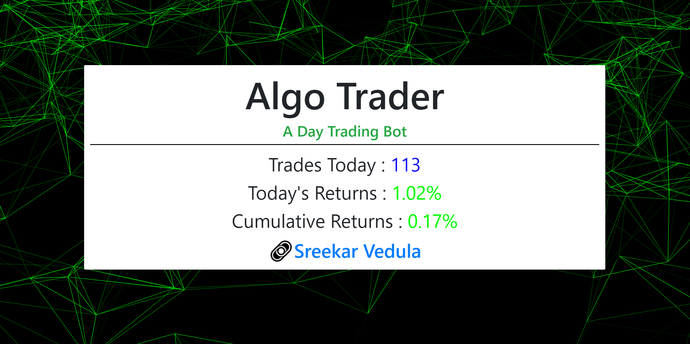

# Algorithmic Day Trader

### Check out the performance here ! - [Sreek's Algo Trader](https://sreek-trader.herokuapp.com/).

An Algorithimic Day Trading Bot that buys and sells stocks automatically throughout the day. It analyzes all the stocks of the NASDAQ 100 index on each run using a combination of technical indicators and buys and sells holdings as needed, averaging 100+ trades per day. 

The Python Script uses two APIs : one to get technical indicators and quotes, and another to place orders on a paper trading platform. This script is scheduled to run several times each day. The Web App, made with React.js, is intended as a stategy performance demo which displays the live returns of the paper trading account.

The Trading Algorithm is continuously being enhanced and optimized to generate greater returns.

